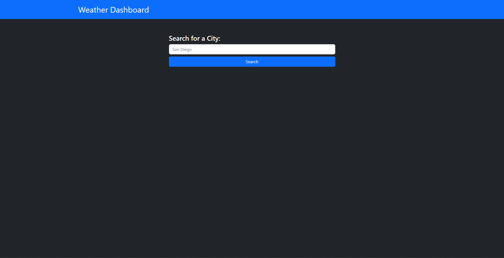
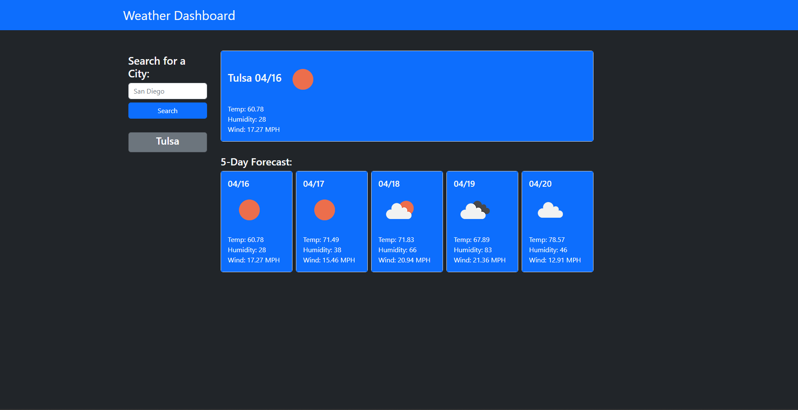
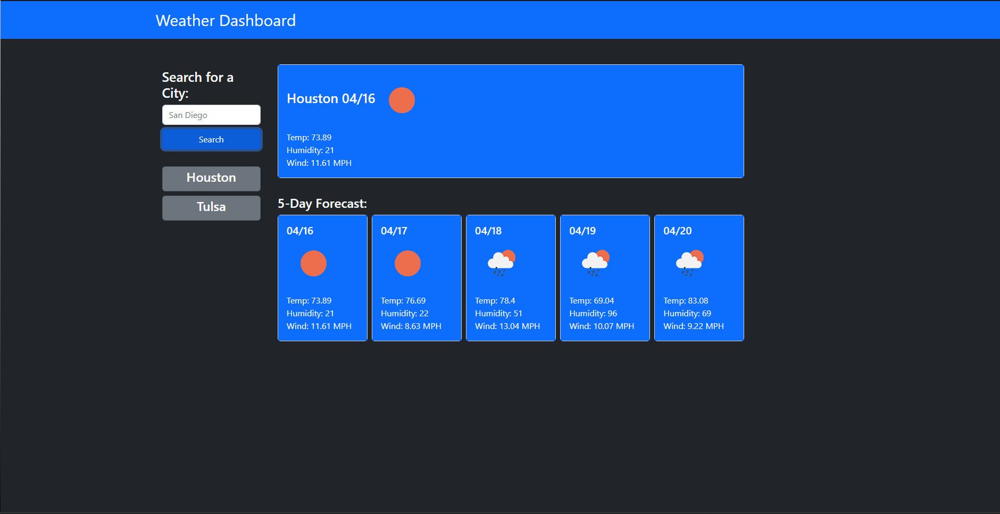

# Weather Dashboard

## Description

This project was built as a way to see a weather report for a searched city. It can help anyone seeking to check future weather in any city. Building this project helped me learn more of JSON objects/arrays as well as general use of server side API's.

## Usage

To use, enter city name into the search bar and click "Search".

You will then be able to see the current weather forecast for that city in the largest box, as well as a 5-day forecast beneath it.

To see previously searched cities, click on one of the gray boxes on the left.

## License

None